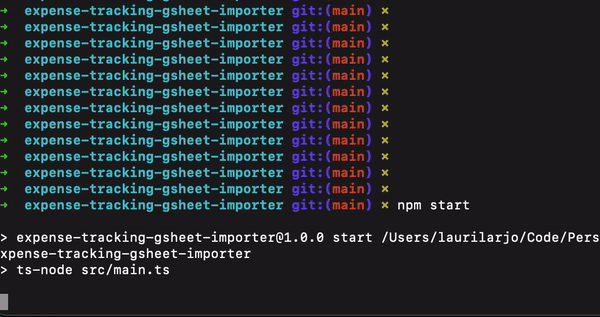

# Expense Tracking - Google Sheets importer

Now with React

Parse different banks' transaction files and import data to Google Sheets.

Bank parser support:

* NordeaFinland, Old side (tsv-format)
* OP (csv)
* Bank Norwegian Credit Card (xlsx)
* Binance Credit Card (xslx)
* NordeaSweden (xls) with currency conversion
* Handelsbanken Sweden (xls-html) with currency conversion

## Requirements

* Install Node
* Install Git
## Setup and 1st time use
1. Clone this project to your machine. Run `npm install`.
1. Make a copy of this sample sheet to your own account and use it as a base (header rows come from it): [https://docs.google.com/spreadsheets/d/1F78PxLNPdAFrcS8XjPI_hTAyh4knTVqq8kd-8ilmDSA/](https://docs.google.com/spreadsheets/d/1F78PxLNPdAFrcS8XjPI_hTAyh4knTVqq8kd-8ilmDSA/).
1. Create and name the data sheets like this: If your name is `Aurelius` and your bank is `OP`, name the sheet `Aurelius OP`. You'll setup this in sheet-config next.
1. Copy `sheet-config.json.sample` to `sheet-config.json`, and replace values with your own.
1. Copy `.env.sample` to `.env`. You don't need to set any vars yet.

1. Go here and complete the "prerequisites" section: [https://developers.google.com/sheets/api/quickstart/nodejs](https://developers.google.com/sheets/api/quickstart/nodejs).
    1. Create a project in Google Cloud Platform
    1. Go to "APIs and Services" and enable the Google Sheets API for it
    1. Go to Credentials -section under the APIs and Services, and create OAuth 2 client ID credentials for a desktop app. Download the resulting json file, rename it to `credentials.json` and put to root of this project.
    1. Go to OAuth Consent Screen -section under the APIs and Services, and add your gmail-account to a test user list.
    1. Run the app with `npm start`. Select `Nothing`, then your user, and whatever bank. Last select `LoginToSheets`.
    1. This should trigger OAuth flow. Follow instructions, and you end up with a `token.json` in your root folder. After this you can start using the app.

2. OPTIONAL. If you need exchange rates, create a free account to [https://exchangeratesapi.io/](https://exchangeratesapi.io/) and add access-key to .env.
 
# Using the app

1. Get an export xls, csv, txt file from your bank, and drop it to the root of this project.
1. Run app with `npm start`.
1. First select the file you want to import, then your user, then your bank.
1. Last select `Import` if you want to add transactions to GSheets. You can also dry-run by reading the sheet's current content, or read the file's content without making changes.

## TODO
- [x] Basic Read sheets
- [x] Basic write transactions to sheets
- [x] Read sheets and filter transactions based on it, so we don't add duplicate data
- [x] Write data by appending to end of file
- [x] Add support to read OP
- [x] Add support to read Nordea Sweden
- [x] Add support to read Handelsbanken Sweden
- [x] Add support to read Norwegian (Finland)
- [x] Bank detection from files won't work. Change to interactive console instead.
- [x] Do not add Handelsbankens if message has a prefix "Prel "
- [x] Do not add Norwegian's "Katevaraus" type
- [x] Add support to read Binance Card
- [ ] Turn this into a hosted service which can be triggered with a Telegram bot.

## Nice to do
- [x] Change currency exchange library to something newer. Current has dependencies to deprecated libs.
