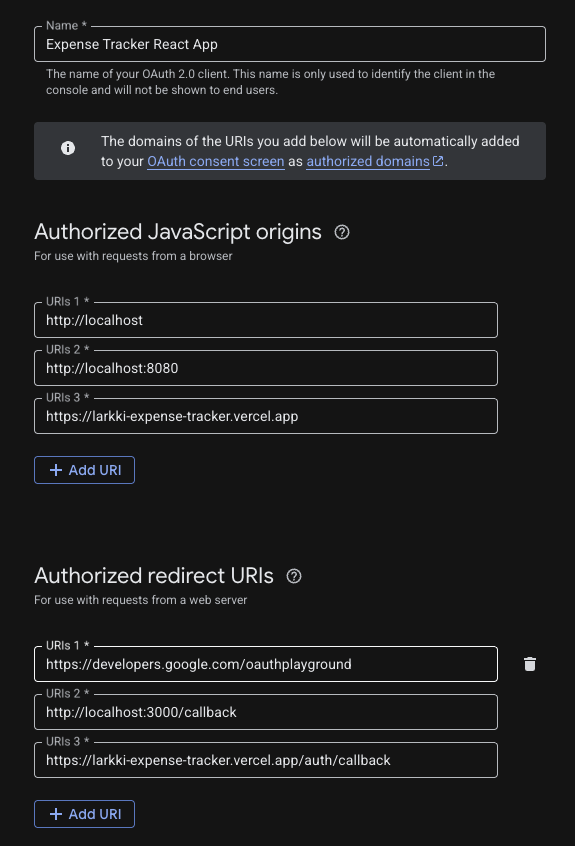

# Lala Expense Tracker

Parse different banks' transaction files and import data to Google Sheets.

Bank parser support:

* NordeaFinland, Old side (tsv-format)
* OP (csv)
* Bank Norwegian Credit Card (xlsx)
* Binance Credit Card (xslx)
* NordeaSweden (xls) with currency conversion
* Handelsbanken Sweden (xls-html) with currency conversion

## Hosting

Vercel: https://larkki-expense-tracker.vercel.app/

## Requirements

* Install Git
* Install Node

## Setup and 1st time use
1. Clone this project to your machine. Run `npm install`.
1. Make a copy of this sample sheet to your own account and use it as a base (header rows come from it): [https://docs.google.com/spreadsheets/d/1F78PxLNPdAFrcS8XjPI_hTAyh4knTVqq8kd-8ilmDSA/](https://docs.google.com/spreadsheets/d/1F78PxLNPdAFrcS8XjPI_hTAyh4knTVqq8kd-8ilmDSA/).
1. Create and name the data sheets like this: If your name is `Aurelius` and your bank is `OP`, name the sheet `Aurelius OP`. You'll setup this in sheet-config next.
1. Copy `sheet-config.json.sample` to `sheet-config.json`, and replace values with your own.
1. Copy `.env.sample` to `.env` and fill in Google Sheets API credentials (`VITE_GOOGLE_API_KEY`, `VITE_GOOGLE_CLIENT_ID`) from the [Google Cloud Console setup](#google-cloud-console-setup) below.
1. OPTIONAL. If you need exchange rates, create a free account to [https://exchangeratesapi.io/](https://exchangeratesapi.io/) and add the access key in the app settings (or via exchange-rate config).

## Google Cloud Console setup

Create a Google Cloud project, then under **APIs & Services**:

1. Enable **Google Sheets API** (and any APIs listed under the API key restrictions below if not already enabled).
2. Configure the **OAuth consent screen** and add your Google account as a test user if the app is still in testing mode.
3. Create **two credentials** under **Credentials**.

### 1. API Key (Browser key)

Create an **API key** and configure it as a browser key:

**API restrictions** — restrict the key to these APIs:

* Google Sheets API
* Identity Toolkit API
* Token Service API

**Application restrictions** → **Websites** (HTTP referrers), then add the origins you will run the app from, for example:

* `http://localhost:8080/*`
* `https://your-production-domain.vercel.app/*`

Copy the key into `.env` as `VITE_GOOGLE_API_KEY`.

### 2. OAuth 2.0 Client ID

Create an **OAuth 2.0 Client ID** of type **Web application**. Configure **Authorized JavaScript origins** and **Authorized redirect URIs** for local development and your production host.

Example settings:

Match the screenshot (swap in your own production host if different):

* **Authorized JavaScript origins**
  * `http://localhost`
  * `http://localhost:8080`
  * `https://larkki-expense-tracker.vercel.app` (your hosting domain here)
* **Authorized redirect URIs**
  * `https://developers.google.com/oauthplayground` (for manual token testing via `/dev`)
  * `http://localhost:8080/auth/callback`
  * `https://larkki-expense-tracker.vercel.app/auth/callback` (your hosting domain here)

Copy the client ID into `.env` as `VITE_GOOGLE_CLIENT_ID`.

### 3. Service account (Telegram bot → Google Sheets)

Same Google Cloud project. No domain-wide delegation.

1. **APIs & Services → Credentials → Create credentials → Service account**. Name e.g. `expense-bot`. Skip optional IAM roles.
2. Open that service account → **Keys → Add key → Create new key → JSON**. Download once; do not commit it.
3. From the JSON, copy `client_email` (looks like `expense-bot@PROJECT.iam.gserviceaccount.com`).
4. In each spreadsheet the bot should write: **Share** → paste that email → role **Editor**.
5. Put the **entire JSON key** as one line in Vercel env `GOOGLE_SERVICE_ACCOUNT_JSON` (and in local `.env` for `npm run bot:dev`).
6. In the app **Settings → Telegram bot**, the service account email is shown after sync.

The browser OAuth client above stays for the web app. The bot never stores your OAuth tokens.

## Telegram bot

1. Create a bot with [BotFather](https://t.me/BotFather); set `TELEGRAM_BOT_TOKEN` and `TELEGRAM_BOT_USERNAME`.
2. Deploy to Vercel with Blob store (`BLOB_READ_WRITE_TOKEN`) and the env vars from `.env.sample`. Set webhook:  
   `https://api.telegram.org/bot<token>/setWebhook?url=https://<your-host>/api/telegram&secret_token=<TELEGRAM_WEBHOOK_SECRET>`
3. Each person: open the web app → Settings → sync settings → share the sheet with the service account → **Connect Telegram** → add the bot to a channel (or tap **Join**).
4. Local without Blob: `npm run api:dev` (filesystem `.data/blob/`) + `npm run bot:dev` (long polling). Vite proxies `/api` to port 8787.

Bank statement files are **never** stored on the server or in Blob—only Telegram `file_id` session metadata.

# Using the app

1. Get an export xls, csv, txt file from your bank, and drop it to the root of this project.
1. Run app with `npm start`.
1. First select the file you want to import, then your user, then your bank.
1. Last select `Import` if you want to add transactions to GSheets. You can also dry-run by reading the sheet's current content, or read the file's content without making changes.

## TODO
- [x] Basic Read sheets
- [x] Basic write transactions to sheets
- [x] Read sheets and filter transactions based on it, so we don't add duplicate data
- [x] Write data by appending to end of file
- [x] Add support to read OP
- [x] Add support to read Nordea Sweden
- [x] Add support to read Handelsbanken Sweden
- [x] Add support to read Norwegian (Finland)
- [x] Bank detection from files won't work. Change to interactive console instead.
- [x] Do not add Handelsbankens if message has a prefix "Prel "
- [x] Do not add Norwegian's "Katevaraus" type
- [x] Add support to read Binance Card
- [x] Turn this into a hosted service.
- [ ] Integrate Telegram bot which could upload the files.

